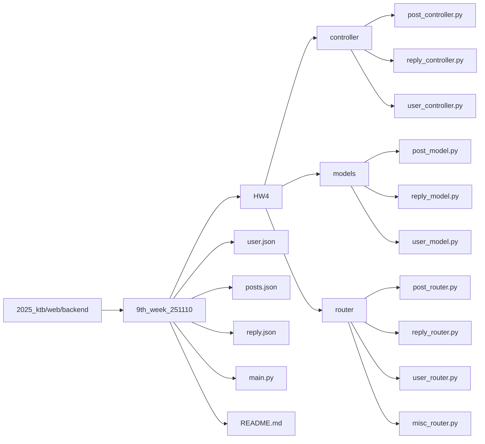

### 과제 주제
4. FastAPI로 Route - Controller - Model 패턴을 적용한 커뮤니티 백엔드를 구현해 보세요.
4-1. Model 코드는 JSON으로만 반환하기 (DB 사용하지 않음)

(필수조건) Postman으로 어떠한 요청을 보내던 예외처리가 잘 되어있어야 함

---

### 폴더구조

```mermaid
graph LR
    A["2025_ktb/web/backend"] --> B["9th_week_251110"]
    B --> C["HW4"]

    B --> E["user.json"]
    B --> F["posts.json"]
    B --> G["reply.json"]

    B --> X1["main.py"]
    B --> X2["README.md"]
    
    C --> C1["controller"]
    C --> C2["models"]
    C --> C3["router"]

    C1 --> D1["post_controller.py"]
    C1 --> D2["reply_controller.py"]
    C1 --> D3["user_controller.py"]

    C2 --> E1["post_model.py"]
    C2 --> E2["reply_model.py"]
    C2 --> E3["user_model.py"]

    C3 --> F1["post_router.py"]
    C3 --> F2["reply_router.py"]
    C3 --> F3["user_router.py"]
    C3 --> F4["misc_router.py"]
```
