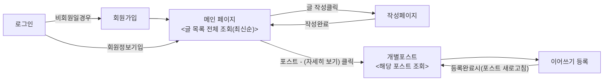

    <image src="KTB_logo_screen.png" width="120" height="66"/>

    <h3>개인프로젝트(커뮤니티 사이트 구축)</h3>

### 프로젝트 개요
하나의 주제나 글이 등록되면 여러 사람이 댓글로 스토리를 달아서 하나의 글을 완성시키는 스토리 생성 커뮤니티

### 기술 스택
- 백엔드 : FastAPI
- DB: SQLite3
- 프론트엔드 : Vue.js

### 프로젝트 특징
- 기존 '아무말 대잔치'의 기본 동작 및 레이아웃을 기반으로 제작
- 특정 사용자가 하나의 글을 시작하면 그 아래에 다른 사람들이 이어서 글을 작성하는 방식(원본 포스트와 댓글의 관계를 약간 비틀어서 사용)
- 최초 글을 시작한 사람이 이야기의 주제와 더불어 생성 가능한 다음 이야기 갯수를 지정(최소 4개, 최대 16개)
- 다음 이야기 작성자는 AI를 이용해 글을 작성하거나 자신의 아이디어를 AI로 보강해서 이어갈 수 있음
- 다음 이야기 갯수가 다 차면 더 이상 이야기 생성이 불가하며, 그 이야기는 박제됨

### 사용자 시나리오(Flow)

### 추가 아이디어
- 시간이 된다면 완성된 이야기에 AI로 일러스트를 만들어 SNS 공유 기능을 붙여도 좋을 것 같음

### 폴더 구조
📦 final_project 
 ┣ 📂 backend 
 ┣ 📂 db 
 ┣ 📂 frontend 
 ┗ 📜 README.md -> 12주차 과제 리드미 

