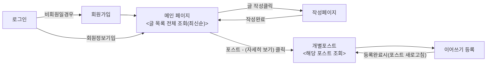
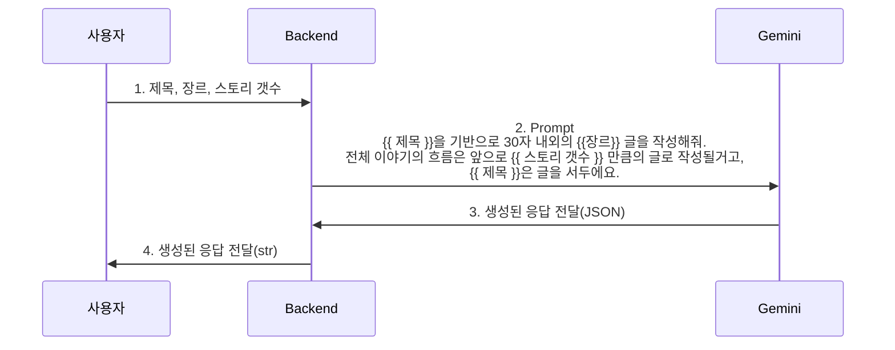
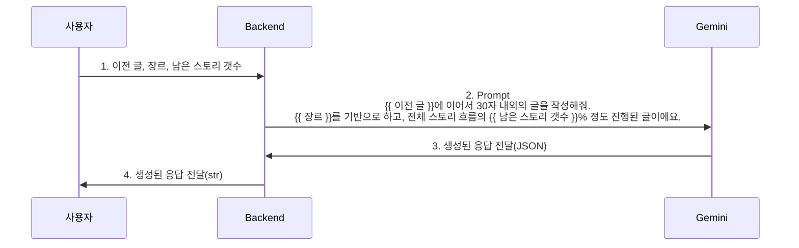

    <image src="KTB_logo_screen.png" width="120" height="66"/>

    <h3>개인프로젝트(커뮤니티 사이트 구축)</h3>

### 프로젝트 개요
하나의 주제나 글이 등록되면 여러 사람이 댓글로 스토리를 달아서 하나의 글을 완성시키는 스토리 생성 커뮤니티

### 프로젝트 데모
MVP: https://relay-story-frontend-production.up.railway.app 
데모영상: https://youtu.be/G1TxnQr2WfU  
- 테스트 계정 
e-mail: test@gmail.com / test2@gmail.com 
password: Test1234@ 

### 기술 스택
- 백엔드 : FastAPI
- DB: postgreSQL
- 프론트엔드 : Vue.js
- 배포 : Railway(Docker 컨테이너로 배포)

### 프로젝트 특징
- 기존 '아무말 대잔치'의 기본 동작 및 레이아웃을 기반으로 제작
- 특정 사용자가 하나의 글을 시작하면 그 아래에 다른 사람들이 이어서 글을 작성하는 방식(원본 포스트와 댓글의 관계를 약간 비틀어서 사용)
- 최초 글을 시작한 사람이 이야기의 주제와 더불어 생성 가능한 다음 이야기 갯수를 지정(최소 4개, 최대 16개)
- 다음 이야기 작성자는 AI를 이용해 글을 작성하거나 자신의 아이디어를 AI로 보강해서 이어갈 수 있음
- 다음 이야기 갯수가 다 차면 더 이상 이야기 생성이 불가하며, 그 이야기는 박제됨

### 사용자 시나리오(Flow)

### ⭐️ AI 적용 시나리오(글 초안 생성, Prompt)

### ⭐️ AI 적용 시나리오(다음 이야기 생성, Prompt)

### 주요 기능
1. 로그인/회원관리: postgreSQL을 활용한 사용자 관리 및 localStorage를 사용한 로그인 상태 유지
2. 게시물 관리: 제목, 내용, 장르, 다음 이야기 갯수로 포스트 생성
3. 릴레이 스토리: 사용자가 작성하거나 AI로 생성한 댓글 추가/삭제
4. AI 생성: 초기 이야기와 다음 이야기를 Google Gemini API로 자동 생성

### 폴더 구조
📦 final_project 
 ┣ 📂 backend 
 ┣ 📂 db 
 ┣ 📂 frontend 
 ┗ 📜 README.md -> 12주차 과제 리드미 

### 프로젝트 배포
1. 배포는 Railway를 사용했습니다.
2. Frontend, Backend 각각 별도의 서버로 배포했고, DB, Storage는 Railway의 기본 제공 기능을 사용했습니다.

### 백엔드 설계 포인트
1. DB의 경우 아직 postgreSQL이 익숙치 않아 클로드의 도움을 받아서 작성했습니다. 동작은 하고 대략적인 흐름은 이해하지만 각 코드의 수행 방식에 대해서 학습을 더 해야합니다.(postgreSQL은 많이 사용하는 것이니 docs를 보고 많이 사용해보려고 합니다.)
2. 각 router에서 db를 의존성으로 주입합니다. 이는 엔드포인트의 호출시 db를 따로 호출해서 동시성 문제와 메모리 누수를 해결합니다. 시간이 좀 있다면 app.py에서의 전역 db생성과 비교해서 얼만큼 문제가 되는지 체크해보면 좋을것 같습니다.

### 프론틍엔드 설계 포인트
1. Vue의 Pinia를 사용한 상태 관리로 프론트엔드에서의 MVC 패턴을 구축하였습니다.

### 향후 추가 기능
❌ 게시물 수정 (update_post) - 코드는 주석처리된 상태 
❌ 릴레이 스토리 수정 (update_comment) - 라우터에서 pass 상태 
❌ 이야기 완성 시 엔딩 생성 (generateEndingContent) - 미구현 
⚠️ 완성된 이야기에 AI로 일러스트를 만들고 인스타그램으로 바로 포스팅하는 기능 

